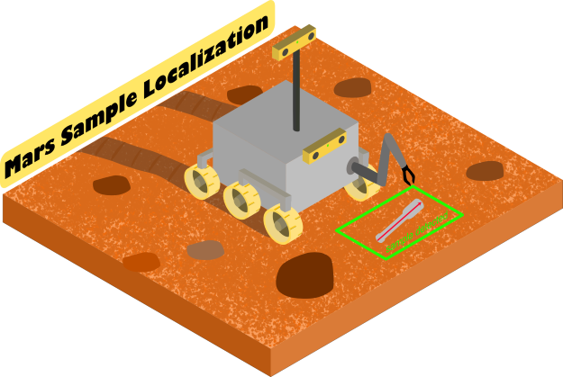

# Mars Sample Localization
[](https://arxiv.org/abs/2206.02622)  [](https://doi.org/10.5281/zenodo.6542933) 
 
<p align="center">
  
</p>

Code associated to the article: **"Hardware-accelerated Mars Sample Localization via deep transfer learning from photorealistic simulations".**
A video of the performed laboratory test can be found at: https://youtu.be/8_ymP6bg6-c


### Citation

If this work was helpful for your research, please consider citing the following BibTeX entry:
```BibTeX
@misc{sampleLoc2022CastillaArquillo,
  doi = {10.48550/ARXIV.2206.02622},
  url = {https://arxiv.org/abs/2206.02622},
  author = {Castilla-Arquillo, Raúl and Pérez-del-Pulgar, Carlos Jesús and Paz-Delgado, Gonzalo Jesús and Gerdes, Levin},
  keywords = {Computer Vision and Pattern Recognition (cs.CV), Artificial Intelligence (cs.AI), Machine Learning (cs.LG), Robotics (cs.RO), FOS: Computer and information sciences, FOS: Computer and information sciences},
  title = {Hardware-accelerated Mars Sample Localization via deep transfer learning from photorealistic simulations},
  publisher = {arXiv},
  year = {2022},
}
```

# Table of contents
1. [Docker Configuration](#dockerconf)
2. [Source Files Structure](#filestructure)
3. [Experiments Scripts](#experiments)
5. [File Tree](#filetree)
6. [License](#license)


## Docker configuration <a name="dockerconf"></a>

An Ubuntu host system is needed to run the files located at the repo, as we use a Nvidia GPU to train the network. First of all, we must install the docker core:

```bash
$ sudo apt-get update

$ sudo apt-get install \
    apt-transport-https \
    ca-certificates \
    curl \
    gnupg-agent \
    software-properties-common
    
$ curl -fsSL https://download.docker.com/linux/ubuntu/gpg | sudo apt-key add -

$ sudo apt-key fingerprint 0EBFCD88

$ sudo add-apt-repository \
   "deb [arch=amd64] https://download.docker.com/linux/ubuntu \
   $(lsb_release -cs) \
   stable"
   
$ sudo apt-get update
$ sudo apt-get install docker-ce docker-ce-cli containerd.io

```
We install our NVIDIA card's drivers and the modules that let us use them in our docker environment:

```bash
$ sudo ubuntu-drivers autoinstall            ## Auto-installs Nvidia drivers
$ sudo apt-get install -y nvidia-docker2 nvidia-container-runtime
```

After that, we must build the configured docker container for this project:

```bash
$ docker build . -f ./dockerfile/yolo_compiler.Dockerfile -t MarsSampleLocalization 
```

We run the docker image:

```bash
$ xhost +local:docker  ## To let docker use the screen

$ docker run -e DISPLAY=$DISPLAY -v /your/cloned/repo/location:/opt \
  -v /tmp/.X11-unix:/tmp/.X11-unix:rw \
  --rm --gpus all \
  --privileged -v /dev/bus/usb:/dev/bus/usb \
  -t MarsSampleLocalization \
  bin/bash 
```
## Source File Structure <a name="filestructure"></a>

Main code files are found inside the **src/** folder. Several Python classes have been implemented:

- **sample.py**: Employed for obtaining the 2D sample pose.
- **coralmodule.py**: Used to run the network in the Google's Coral TPU and detect the sample in any image.
- **cameradepth.py**: Used to implement both stereo cameras, create DEMs and convert 2D points to 3D world coordinates.

Additionally, the script **main_examples.py** can be executed from root to test example applications with images and depth files located inside the folder **src/example_files**.

## Experiments Scripts <a name="experiments"></a>

Bash scripts have been generated to use some tools and perform several experiments once the Zenodo dataset is unzipped into the **datasets**/ folder:

- **train_datasets.sh**: To train the neural networks with Darknet Framework. It is neccessary to modify the **./3rdparty_darknet/Makefile** to use the GPU for training.
- **darknet_to_coral.sh**: To convert the trained Darknet network into a .tflite executable by the TPU.
- **detect_datasets.sh**: To make detections of the sample tube with Darknet framework.
- **test_coral.sh**: To make detections of the sample tube with Coral TPU and to extract metrics. Uses **./src/main_coraldetect.py** script.
- **test_datasets.sh**: To extract metrics of the detections of the sample tube with Darknet framework.
- **test_fieldtest.sh**: To perform the **Mars Sample Localization** procedure with the laboratiry test dataset. Uses **./src/main_fieldtest.py** script.
- **test_orientation.sh**: Uses **./src/main_orientation.py** script. Employed fo testing the pose estimation algorithm.


## File Tree <a name="filetree"></a>
The general file tree view is the following:
```
.
├── 3rdparty_coral
│   ├── coral_inference
│   ├── darknet_to_keras
│   └── keras_to_tflite
|
├── 3rdparty_darknet
|
├── datasets
│   ├── field_tests_images
│   ├── sample_orientation_images
│   └── train_images
|
├── dockerfile
|
├── output_files
│   ├── compiled_coral
│   ├── coral_detection
│   ├── darknet_detections
│   ├── darknet_weights
│   ├── fieldtest
│   ├── keras_conversion
│   ├── log
│   ├── orientation_images
│   └── quantized_tflite
├── src
│   ├── example_files
|   |
|   ├── coralmodule.py
│   ├── cameradepth.py
|   ├── main_coraldetect.py
│   ├── main_examples.py
│   ├── main_fieldtest.py
│   ├── main_orientation.py
│   └── sample.py
|
├── training_files
|    ├── cfg
|    ├── darknet_data
|    └── generated_weights
| 
├── darknet_to_coral.sh
├── detect_coral.sh
├── detect_datasets.sh
├── generate_data.sh
├── test_coral.sh
├── test_datasets.sh
├── test_fieldtest.sh
├── test_orientation.sh
└── train_datasets.sh
```

## License  <a name="license"></a>

This repository is released under the MIT open source license as found in the [LICENSE](LICENSE) file.
